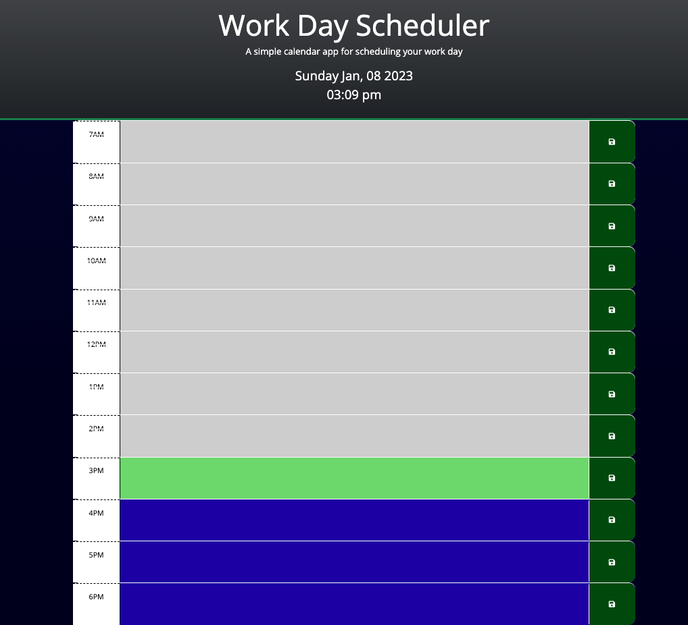

  # Daily Workday Scheduler 

  ## Description:
  Workday scheduler that can help a user outline and organize their workday by the hour.

  ## Table of Contents:
  - [Installation](#installation)
  - [Usage](#usage)
  - [License](#license)
  - [Contributions](#contributions)
  - [Published Page](#page)
  - [Repo](#repo)

 ## Installation
  No istallation is needed just follow the [link](#page) below to the webpage.

 ## Usage 
  Once on the webpage you will see the current date and time displayed at the top, you will also see timeframe blocks from 7am to 6pm, if time has passed block will apear gray and the time will have a dash through it. Any hour that hasn't passed will be highlighted in a light blue color, and the current hour will be highlighted in green. A user can write notes for the different hours throughout their work day and save it to review throughout the day.

 ## License 
  
  
  
 ## Contributions 
  N/A

 ## Screen Shot

  

# LINKS

 ## Page 
  https://zcordeiro.github.io/Daily-Workday-Scheduler/

 ## Repo 
  https://github.com/Zcordeiro/Daily-Workday-Scheduler
